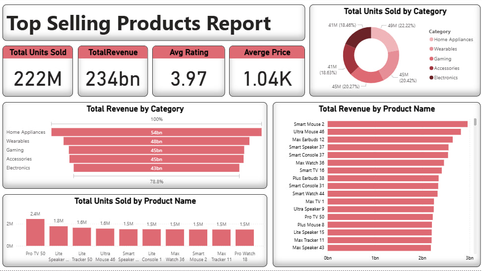

# 🛒 Top Selling Products Report

## 📌 Overview

This project delivers a **Top Selling Products Report** that highlights sales performance across categories and individual products.
The report is built as a **dynamic Power BI dashboard**, making it easy for decision-makers to track performance and identify opportunities.

## 🎯 Problem

Businesses often face challenges in:

* Tracking which products bring the most revenue.
* Identifying top-selling items by units sold.
* Understanding how customer ratings and prices affect performance.

## 💡 Solution

A **Power BI Dashboard** was designed to summarize and visualize sales KPIs, giving a clear picture of performance and guiding strategic decisions.

## 📊 Key Metrics

* **Total Units Sold:** 222M
* **Total Revenue:** 234bn
* **Average Rating:** 3.97
* **Average Price:** 1.04K

## 📈 Insights

* **Home Appliances** is the leading category by revenue (54bn).
* **Pro TV 50** is the best-selling product by units (2.4M).
* **Smart Mouse 2** generated the highest revenue among products.

## ✅ Recommendations

* Focus marketing on **Home Appliances** due to high profitability.
* Reassess low-selling products to improve or discontinue.
* Build on the success of **Smart Mouse 2** with new versions or product lines.

## 🛠️ Tools Used

* **Power BI** → Dashboard & Visualization
* **SQL** → Data preparation & querying
* **Excel/CSV** → Raw data source

## 🚀 How to Use

1. Clone this repository:

   ```bash
   git clone https://github.com/yourusername/top-selling-products-report.git
   ```
2. Open the `.pbix` file in **Power BI Desktop**.
3. Refresh the data and explore the dashboard.

## 📷 Dashboard Preview

  


تحبي أخلي العنوان الرئيسي في الـ README "**Sales Analysis Dashboard**" ولا "**Top Selling Products Report**" زي ما كتبتي؟
